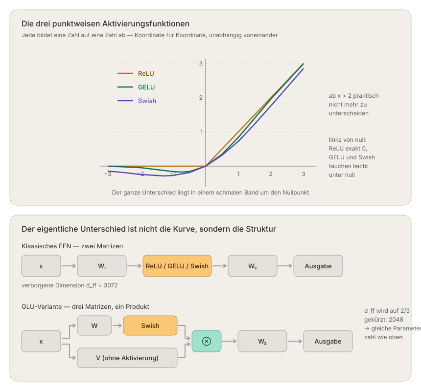

# GLU Variants

The transfromer-block contains two parts: Attention (mix information between tokens) and FFN (work on each token position wiese). Original FFN:
$$
\text{FFN}(x)=\max(0,xW_1)W_2
$$

So the dimension gets higher (e.g., d=768 -> d_ff=3072) is non-linaere filteed and then shrinked down again. wthout the non-linarity W_1 and W_2 would foult into a singal matrx. The aktivations funktion is what makes deep networks reasonable.

1. ReLU = $\max(0,x)$
2. GELU  $x \cdot \Phi(x)$
3. Swish = $x \cdot \sigma(\beta x)$
4. SwiGLU = $(Swish(xW) \otimes xV)W_2$
   

