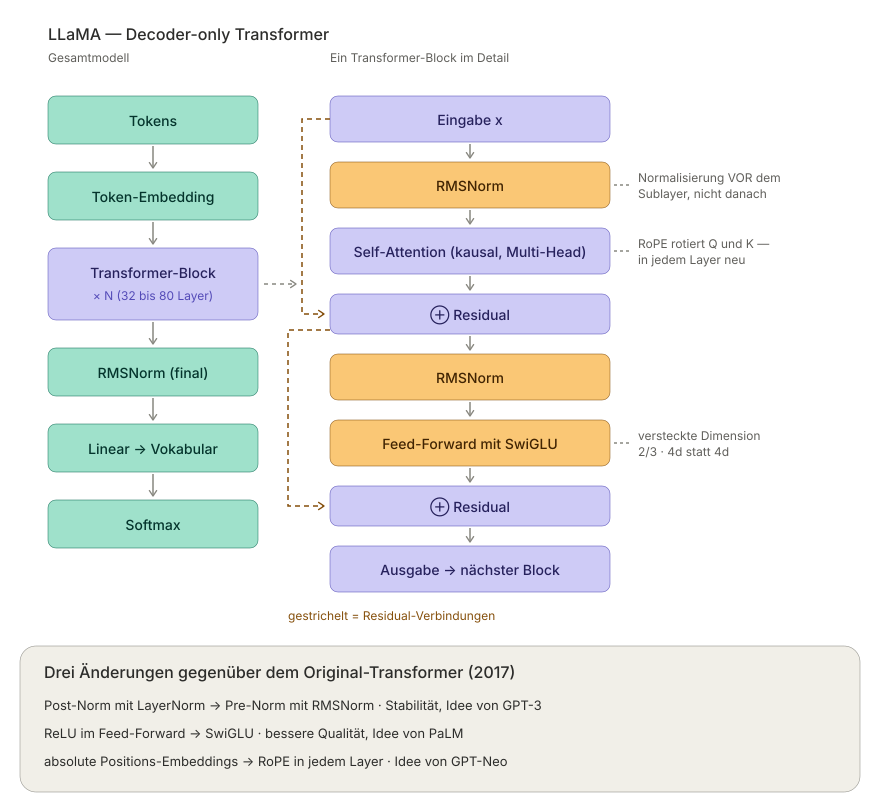

# LLaMA 

- Meta Ai
- Feb. 2023
- LLaMA-1 family 

## LLaMA - Large Language Model Meta AI

The most important aspect of the paper is not a change in architecture, but an economic insight: Chinchilla (2022) was optimized for training compute: “Given this budget: how large should the model be, and how many tokens should it have?” LLaMA, on the other hand, was optimized for the inference budget, since inference runs millions of times, while training runs only once.

The result was four models of varying sizes, ranging from 5B parameters to 65B. All models are based on the same decoder-only architecture with a series of previously known optimizations of the original Transformer (Figure 1).

Particularly interesting was that LLaMA-13B outperforms GPT-3 (175B) on most benchmarks with 10× fewer parameters and runs on a single GPU. This is exactly what suddenly made local LLMs a reality.

