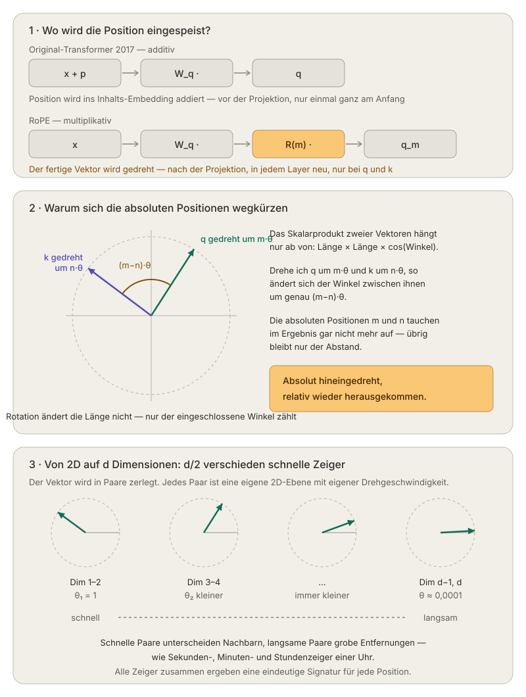

# RoPE

- RoFormer: Enhanced Transformer with Rotary Position Embedding
- 9. November 2023
- Wezuiyi.com

Why positional embedding (PE)? The raw attetion-module does not know anything about positions between tokens, a sentence is just a set, not a sequence: “I am a student” and “Am I a student?” would be indistinguishable.

Original PE (Transformer 2017): The positionvector is added to the token embedding (x+p), which had two disadvantages. The position is mixed with the token embedding, they share the same dimensions and interfere with each other. Also to absolute position is coded, but language nedd relative distances between each token. 

Approach: RoPE "Rotary Position Embedding", the authors defined a function, where the dot product only depeneds on the content of both token and their distance, the absolute positions m and n should cancel each other out:
$$
⟨f_q(x_m,m),f_k(x_n,n)⟩=g(x_m,x_n, m-n)
$$

Solution: They solved the problem in 2D using complex numbers.
> Rotate the vector by an angle of $m \cdot \theta$, where m is the position.

The dot product of two vectors depends only on their magnitudes and the angle between them. A rotation does not change the magnitude. If $q$ is rotated by $m \cdot \theta$ and $k$ by $n \cdot \theta$, the angle between them changes by exactly $(m−n)\cot \theta$.

Example:

Chose $\theta = 0.5 rad$ and two Vectors, booth randomly $(1.0)$.
1. q at position 2, k at position 5:
   - q rotated at $2 \cdot 0.5 = 1.0 rad \rightarrow (\cos 1.0, \sin 1.0)=(0.540 | 0.841)$
   - k rotated at $5 \cdot 0.5 = 2.5 rad \rightarrow (\cos 2.5, \sin 2.5)=(−0.801 | 0.599)$
   - dot product: $0.540 \cdot (−0.801) + 0.841 \cdot 0.599 = −0.433 + 0.504 = \mathbf{0.071}$
2. q at position 7, k at position 10:
   - q rotated at $7 \cdot 0.5 = 3.5 rad \rightarrow (\cos 3.5, \sin 3.5)=(−0.936 | −0.351)$
   - k rotated at $10 \cdot 0.5 = 5.0 rad \rightarrow (\cos 5.0, \sin 5.0)=(0.284 | −0.959)$
   - dot product: $(−0.936)·0.284 + (−0.351)·(−0.959) = −0.266 + 0.337 = \mathbf{0.071}$

Benefits:
- Long-term decay: Tokens that are far apart inherently have a weaker influence on each other.
- Flexibility in length: There is no predefined table with a maximum length. m is simply a number in the angle.
- Compatible with linear attention: Other approaches to solving this problem interfere with the softmax scalar product and only work with quadratic attention. RoPRE only modifies q and k themselves, regardless of which attention variant is used. RoPE can be applied before it.
- Numerically stable. Rotation matrices are orthogonal, and the vector lengths are preserved exactly. Nothing explodes, nothing disappears.
